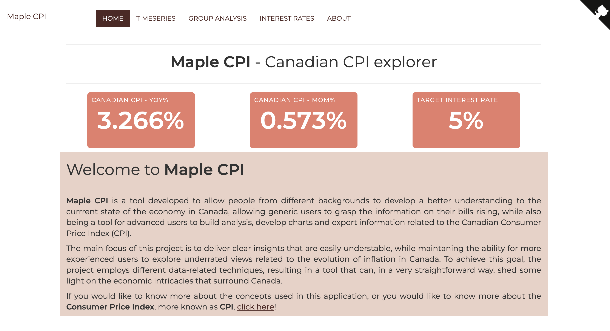
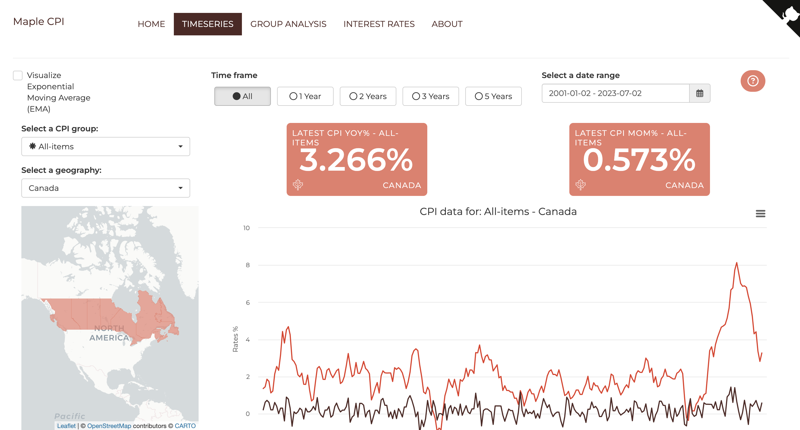
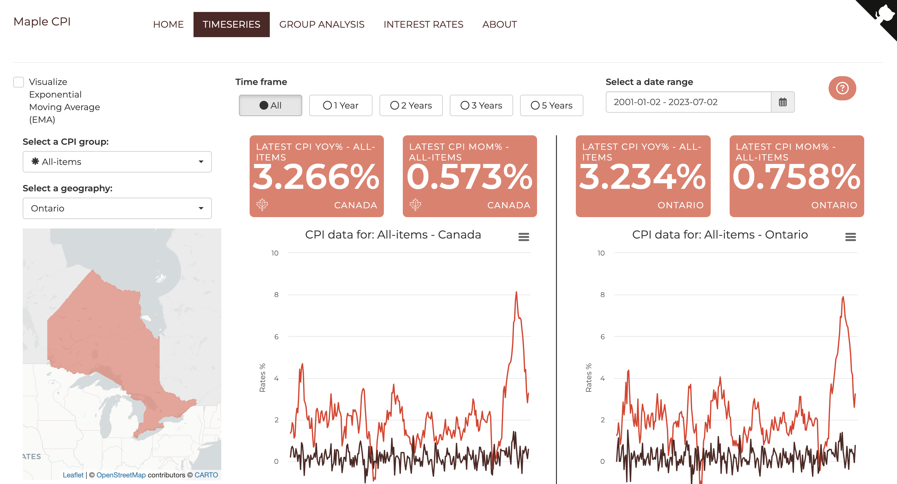
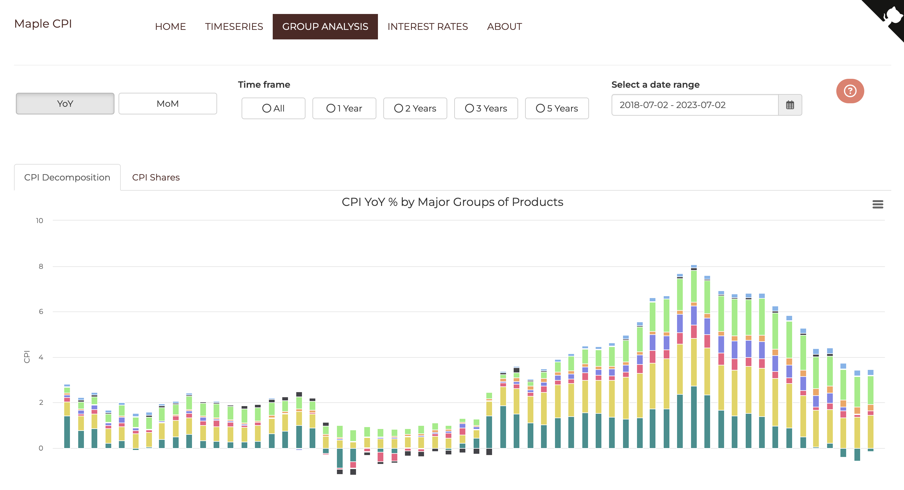
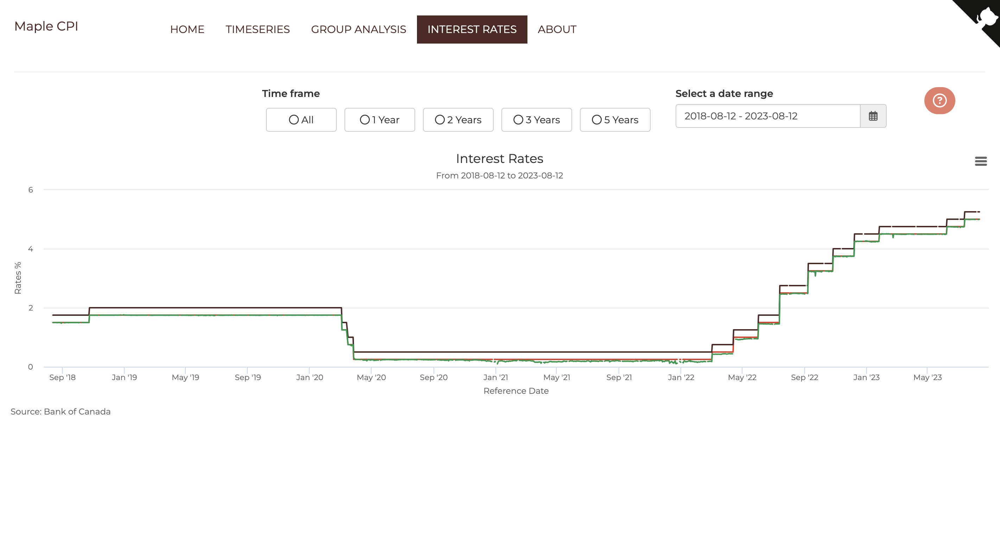

# Maple CPI <a href='https://paese.shinyapps.io/maple_cpi/'></a>

```{r setup, include=FALSE}
knitr::opts_chunk$set(echo = TRUE)
```

## About the app

**Maple CPI** is a tool developed to allow people from different backgrounds to develop a better understanding of the current state of the economy in Canada, allowing generic users to grasp the information on their bills rising, while also being a tool for advanced users to build analysis, develop charts and export information related to the Canadian Consumer Price Index (CPI). The tool's name is derived from a Canadian symbol, a Maple leaf, and the acronym for the main inflation index, the CPI.

## Links

+ Live version: [Maple CPI - Live app](https://maplecpi.ca/)
<!-- + RStudio cloud: [Maple CPI - RStudio cloud](https://rstudio.cloud/project/123456) -->
+ GitHub: [Maple CPI - Github](https://github.com/paeselhz/maple_cpi)

## Highlights

In the past couple of months, inflation has been plaguing the bills of almost every citizen around the world, Being it related to supply chain constraints or the rise of inflation rates by almost every central bank, it is common understanding that living got more expensive. Here in Canada Statistics Canada does a great job of collecting information about the pricing level for almost 500 products every month and compiling it into a single indicator used to evaluate the state of inflation throughout the country, mostly known as CPI (Consumer Price Index).

This monthly data however allows us to explore differences in the development (growth and contraction) of inflation by checking different regionalities, or different major groups of products, and compare what are the main culprits for the present situation of the Canadian economy.

The tool follows a progressive step allowing the user to start from simple visualizations for the time series of Canadian inflation and its components, drilling down to check on a province level how each major group behaves, moving to more a in-depth analysis of a decomposition of the CPI index by it's eight major groups, data related to the Interest rates target set by Bank of Canada and an about page with some further explanation about the CPI.



### Time series

The timeseries tab allows users to view data related to the Consumer Price Index (CPI) on
a National level, as well as on a Provincial level, comparing the information for the CPI,
or for each of the eight major groups that compose the index. 

Besides that, the user can select different time windows to view the information, as well
as add an Exponential Moving Average line to the plots.


By clicking on a province in the map on the left, the user will be shown the information
for CPI on the entire country, as well as on the province selected.



### Group Analysis

For the group analysis tab, this leverages the basket weights for each of the eight
major components of the CPI to demonstrate visually the contribution that each
of the components had on the total CPI.



### Interest Rates

Also, to provide information on the decisions made by the Bank of Canada, the
interest rates tab displays information about the Policy rate set by the Bank,
the Bank rates that are being used, and the CORRA, the Canadian Overnight
Repo Rate Average.



## Conclusion

With this app, I hope to shed some light on the current impacts of inflation
in Canada, by providing different points of view, and different visualizations
that support a more comprehensive understanding of the current state of the Canadian
economy.

For further information about CPI, the About tab provides links to the data
sources in Statistics Canada, as well as some definitions that were used throughout 
the application.

For comments or suggestions, feel free to open an issue on [GitHub](https://github.com/paeselhz/maple_cpi/issues).

---

Luis HZ Paese
